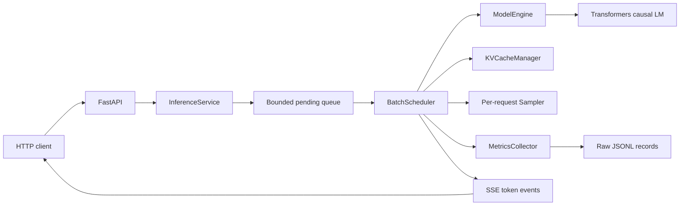

# Continuous Batching Technical Report

## Executive summary

This project implements a correctness-first, single-GPU inference server that
demonstrates iteration-level continuous batching without relying on a serving
framework such as vLLM or TensorRT-LLM. It provides three scheduling policies over
the same model execution path:

- `sequential`: one request runs at a time.
- `static`: a fixed cohort runs to completion before queued work is admitted.
- `continuous`: completed sequences are evicted every decoding iteration and queued
  requests immediately reuse the available slots.

The implementation includes a FastAPI server, synchronous and streaming generation
endpoints, bounded admission, deterministic sampling, logical KV-cache accounting,
JSONL metrics with provenance, closed-loop and Poisson load generation, Slurm
automation, and comparison analysis.

The final measured experiment ran on a Brown Oscar NVIDIA A40. It covered three
scheduling modes, four concurrency levels, two output-length workloads, and three
trials per configuration: 24 configurations and 2,304 measured requests. At
concurrency 8:

| Workload | Sequential tok/s | Static tok/s | Continuous tok/s | Continuous vs sequential | Static p99 E2E | Continuous p99 E2E |
| --- | ---: | ---: | ---: | ---: | ---: | ---: |
| Bimodal | 33.46 | 53.43 | 52.41 | +56.6% | 5,925 ms | 4,860 ms |
| Uniform | 34.11 | 54.79 | 53.74 | +57.5% | 5,151 ms | 4,717 ms |

Continuous batching matched static throughput within 2% at concurrency 8 while
reducing p99 end-to-end latency by 18.0% on the bimodal workload and 8.4% on the
uniform workload. At concurrency 2 and 4, continuous batching also exceeded static
throughput because it could refill partially completed cohorts sooner.

## Scope and design goals

The project was built to answer a narrow question clearly: what scheduling behavior
and performance effects appear when a decoder-only language model moves from
sequential or cohort-based execution to iteration-level continuous batching?

The design priorities were:

1. Use one model forward implementation for every scheduling policy.
2. Preserve per-request generation behavior as batch composition changes.
3. Make admission, ownership, and token-budget decisions explicit and testable.
4. Record enough raw data and provenance to reproduce every reported number.
5. Keep GPU execution portable across Brown Oscar and standalone Linux CUDA hosts.
6. State optimization boundaries honestly rather than presenting logical cache
   accounting as a production KV-cache implementation.

## System architecture



The code is split by responsibility:

| Component | File | Responsibility |
| --- | --- | --- |
| Configuration | `src/continuous_batching/config.py` | Validates model, batch, sequence, cache, device, and policy settings. |
| Request state | `src/continuous_batching/models.py` | Defines immutable requests and mutable sequence lifecycle state. |
| Scheduler | `src/continuous_batching/scheduler.py` | Owns pending, active, and completed queues; admission; stepping; eviction; and token events. |
| Model engine | `src/continuous_batching/engine.py` | Tokenization, ragged batch construction, model forwarding, decoding, device, and dtype. |
| Cache manager | `src/continuous_batching/cache.py` | Fixed-slot ownership and bounded logical token-capacity accounting. |
| Sampling | `src/continuous_batching/sampling.py` | Greedy and seeded temperature/top-p sampling. |
| Server | `src/continuous_batching/server.py` | FastAPI lifecycle, HTTP validation, async worker, synchronous responses, and SSE streams. |
| Metrics | `src/continuous_batching/metrics.py` | Request latency, throughput, goodput, active-batch traces, and run provenance. |
| Load generation | `bench/loadgen.py` | Closed-loop and Poisson arrivals with deterministic output-length workloads. |
| Analysis | `bench/analyze.py`, `bench/compare.py` | Per-run summaries, matrix CSV/JSON, histograms, and mode comparison figures. |

## Request lifecycle

### 1. API validation and submission

`POST /generate_sync` and `POST /generate` accept a prompt, optional request ID,
maximum output length, temperature, top-p value, and seed. Pydantic validates the
HTTP body before `GenerationRequest` applies domain validation.

`InferenceService.submit` creates both:

- a future for the final synchronous response; and
- an async queue for streaming token events.

The scheduler submission is moved to a worker thread so model scheduling does not
block the FastAPI event loop.

### 2. Tokenization and capacity validation

`BatchScheduler.submit` tokenizes the prompt, resolves the output limit, and computes
the reservation:

```text
reserved tokens = prompt tokens + maximum new tokens
```

The request is rejected before entering the queue if:

- its total capacity exceeds `max_seq_len`;
- its capacity alone exceeds the global logical cache budget;
- its request ID is already present; or
- the bounded pending queue is full.

Queue overload maps to HTTP 429, invalid sequence requests map to HTTP 422, and a
failed inference worker maps to HTTP 503.

### 3. Policy-specific admission

The scheduler maintains `pending`, `active`, and `completed` collections.

| Policy | Admission target | Refill behavior |
| --- | ---: | --- |
| Sequential | 1 | Admit only after the active request finishes. |
| Static | `static_batch_size` | Admit a cohort only when no previous cohort is active. |
| Continuous | `max_batch_size` | Attempt admission at every decoding iteration. |

Admission is first-come, first-served. A request at the head of the pending queue
stays queued if no slot or token capacity is available; the scheduler never
overallocates the configured budget.

### 4. Ragged model execution

Active sequences can have different visible lengths. `build_ragged_batch` right-pads
their token rows and constructs:

- `input_ids`;
- an explicit attention mask;
- explicit position IDs; and
- the original sequence lengths used to select each row's final logits.

Every scheduling mode calls the same `ModelEngine.prefill` and
`ModelEngine.decode_step` path. This separation is important: scheduling changes when
a sequence advances, but not how its logits or sampled token are computed.

### 5. Sampling and completion

Temperature zero uses greedy `argmax`. Nonzero temperature supports top-p filtering
and uses a request-local `torch.Generator` seeded from the request. A request's random
stream therefore does not depend on its row position or on other requests entering or
leaving the batch.

After each token:

1. The scheduler updates sequence and logical cache state.
2. It records first-token time when applicable.
3. It emits an SSE event containing token ID, full text, text delta, and completion.
4. EOS or the output-token limit marks the sequence finished.
5. Eviction frees the slot, clears its state, records metrics, and exposes that slot
   to the next iteration's admission pass.

### 6. Failure behavior

An unhandled scheduler or model error is treated as fatal for the inference worker.
All active and pending requests are marked failed, owned slots are released, waiting
futures receive the exception, and streams receive a terminal error event. Errors are
not silently converted into successful responses.

## Cache semantics and current optimization boundary

`KVCacheManager` provides:

- a deterministic fixed-size slot pool;
- exclusive request ownership;
- full prompt-plus-output capacity reservation;
- an optional global token budget;
- ownership checks on every update and free;
- slot clearing before reuse; and
- snapshots used by correctness tests.

The current engine intentionally uses:

```python
use_cache=False
```

It recomputes every active sequence's visible prefix on every iteration. The manager
therefore models KV-cache ownership and capacity correctly, but it does not yet
provide the performance benefit of persistent transformer `past_key_values`.

This distinction matters when interpreting the results. The benchmark isolates the
benefit of scheduling and dynamic batch composition, not an optimized serving
kernel. The next core engineering phase is to prefill once, retain per-sequence KV
state, decode only new tokens, and correctly handle a mixed batch containing both new
prefills and existing decode sequences.

## Correctness strategy

The local test suite uses tiny deterministic fake models, so it runs without network
or GPU access. The 12 tests cover:

- ragged attention masks and position IDs;
- cache slot ownership and complete clearing on reuse;
- admission under a constrained token budget;
- greedy token equality across all scheduling modes and arrival orders;
- immediate replacement of a completed sequence in continuous mode;
- one unique output for every submitted input;
- batch-order-independent seeded sampling;
- deterministic workload generation;
- synchronous and streaming FastAPI behavior; and
- comparison analyzer extraction of mode, concurrency, and workload.

These tests establish the key invariant: for the same request and sampling
configuration, changing the scheduling policy must not change token generation.

## Metrics and provenance

### Request metrics

For every completed request:

```text
TTFT = first token time - arrival time
TPOT = (finish time - first token time) / (output tokens - 1)
E2E  = finish time - arrival time
```

The collector reports p50 and p99 TTFT, TPOT, and end-to-end latency. Throughput is
the total number of output tokens divided by the interval from the first arrival to
the final completion. Goodput counts requests meeting configurable TTFT and
end-to-end SLOs per second.

### Batch metrics

The scheduler records active batch size only when it changes. The metrics endpoint
derives:

- the complete timestamped trace;
- a batch-size occurrence histogram; and
- a duration-weighted average active batch size.

### Provenance

Raw server records include:

- Git commit and dirty state;
- complete inference configuration;
- model and tokenizer classes and model configuration;
- Python and package versions;
- CUDA availability and runtime;
- GPU name and count;
- hostname and platform; and
- timestamps for requests and batch transitions.

Raw JSONL, logs, model weights, caches, and profiler data are gitignored. The
analyzers derive reviewable JSON, CSV, and PNG artifacts from retained raw records.

## Brown Oscar implementation

### Account and resource model

The work used Brown Oscar's general `gpu` partition under an exploratory account.
Model workloads ran only through Slurm allocations, never on a login node.

The environment setup:

1. Loaded Oscar's CUDA, cuDNN, and Python 3.11 modules.
2. Created `$HOME/continuous-batching.venv`.
3. Installed the project and pinned dependencies in editable mode.
4. Stored Hugging Face downloads under `$HOME/scratch/hf_cache`.
5. Ran the CUDA/VRAM preflight before starting any server.

The interactive setup allocation first confirmed CUDA using an NVIDIA RTX A5500.
Recorded smoke and comparison jobs were subsequently scheduled on A40 nodes.

### Automation

Three Slurm entry points were added:

| Script | Purpose |
| --- | --- |
| `scripts/slurm_server.sh` | Starts one configured server and records server metrics. |
| `scripts/slurm_smoke.sh` | Starts a server, validates readiness, runs a small three-trial gate, and shuts down cleanly. |
| `scripts/slurm_compare.sh` | Runs sequential, static, and continuous servers one at a time and records the complete comparison matrix. |

Loading only one server at a time avoids requiring enough VRAM for multiple 7B model
copies. Each script uses `SLURM_SUBMIT_DIR`, creates output directories, loads the
same modules, activates the same virtual environment, and writes job-specific logs
and raw records.

### Safe submission

The default Oscar smoke and comparison use the public
`Qwen/Qwen2.5-7B-Instruct` model and require no Hugging Face credential:

```bash
sbatch scripts/slurm_smoke.sh
sbatch scripts/slurm_compare.sh
```

For a gated model, accept its license first and enter a read-only token without
placing it in shell history:

```bash
read -rsp "HF token: " HF_TOKEN; echo
export HF_TOKEN
export MODEL_NAME="meta-llama/Llama-3.1-8B-Instruct"
sbatch scripts/slurm_smoke.sh
unset HF_TOKEN MODEL_NAME
```

Credentials must never be pasted into chat, committed, printed, or embedded in job
scripts. Any exposed token should be revoked and replaced.

### Reliable readiness and cleanup

The Slurm jobs start the server in the background and keep its PID. Readiness
requires all of the following:

1. The server process is still alive.
2. `GET /metrics` returns a successful response.
3. The response parses as JSON.
4. The expected `request_count` field exists.

The scripts trap shell exit, terminate the exact server PID, and wait for cleanup.
This prevents a failed load generator from leaving a server behind.

## Bring-up and debugging history

The first successful benchmark required several operational and methodological
corrections.

### 1. Oscar-specific Slurm configuration

The initial wrapper referenced a condo partition that an exploratory account could
not rely on. It was changed to the general `gpu` partition with one GPU, one task,
four requested CPU cores, 40 GB memory, and explicit Python 3.11 module loading.

### 2. Gated model access

Job `5068913` reached an A40 but failed with HTTP 401 while loading gated Llama 3.1
weights. The default smoke model was changed to public Qwen 2.5 7B so infrastructure
validation could not be blocked by an external license or token. Gated Llama remains
an explicit override.

### 3. Oscar HTTP proxy and false readiness

Job `5069045` failed after four seconds. Oscar's proxy environment intercepted
loopback HTTP traffic, so a status-only readiness check accepted a non-server
response. The load generator later failed while parsing that response as JSON.

The fix was:

```bash
export NO_PROXY="${NO_PROXY:+$NO_PROXY,}127.0.0.1,localhost"
export no_proxy="$NO_PROXY"
```

The readiness probe was also strengthened to parse `/metrics` and assert a known
field. This fixed both the health check and subsequent load-generator traffic.

### 4. Successful smoke gate

Job `5069129` completed on an A40:

| Metric | Value |
| --- | ---: |
| Requests | 24 |
| Output tokens | 453 |
| Throughput | 45.06 tok/s |
| p50 TTFT | 74.79 ms |
| p99 TTFT | 110.97 ms |
| p50 TPOT | 41.19 ms |
| p99 TPOT | 42.62 ms |
| p50 end-to-end | 599.16 ms |
| p99 end-to-end | 1,360.28 ms |

### 5. Pilot comparison and cohort-count correction

Job `5069358` completed all 24 configurations, but its eight requests per trial
equaled the maximum concurrency. At concurrency 8, static and continuous modes saw
only one cohort, so continuous admission never had queued work available to refill a
finished slot.

The measured-run default was corrected to 32 requests per trial and eight warmup
requests. This guarantees four request waves at concurrency 8 and exercises the
behavior being studied.

### 6. Final measured comparison

Job `5070013` completed on `gpu2110` in 24 minutes 52 seconds:

- Slurm state: `COMPLETED`
- Exit code: `0:0`
- Result files: 24
- Stderr: empty
- Tracked source commit: `2740d68`

SSH disconnections did not affect the job because `sbatch` execution was independent
of the login session.

## Final benchmark methodology

### Hardware and software

| Setting | Value |
| --- | --- |
| Cluster | Brown Oscar |
| GPU | NVIDIA A40 |
| Visible VRAM | 44.42 GiB |
| CUDA runtime | 12.6 |
| PyTorch | 2.7.1+cu126 |
| Transformers | 4.53.1 |
| Python | 3.11 |
| Model | `Qwen/Qwen2.5-7B-Instruct` |
| Dtype | bfloat16 |

### Server configuration

| Setting | Value |
| --- | ---: |
| Maximum batch size | 8 |
| Static batch size | 8 |
| Maximum sequence length | 512 |
| Logical cache budget | 4,096 tokens |
| Device | CUDA |
| Policies | sequential, static, continuous |

### Workload matrix

| Dimension | Values |
| --- | --- |
| Arrival model | Closed-loop |
| Concurrency | 1, 2, 4, 8 |
| Output workloads | Uniform, bimodal |
| Output length range | 8-32 tokens |
| Requests per trial | 32 |
| Warmup requests per configuration | 8 |
| Measured trials | 3 |
| Measured requests per configuration | 96 |
| Total configurations | 24 |
| Total measured requests | 2,304 |

Prompts came from the fixed `bench/prompts.txt` set. Output lengths and request seeds
were deterministic. Sequential, static, and continuous modes ran one after another
on the same allocated GPU.

## Final results

### Bimodal output lengths

| Mode | Concurrency | Throughput tok/s | p99 E2E ms |
| --- | ---: | ---: | ---: |
| Sequential | 1 | 33.74 | 1,007.21 |
| Static | 1 | 33.79 | 1,005.48 |
| Continuous | 1 | 33.69 | 1,009.08 |
| Sequential | 2 | 33.55 | 1,978.14 |
| Static | 2 | 33.87 | 1,901.42 |
| Continuous | 2 | 44.64 | 1,505.53 |
| Sequential | 4 | 33.58 | 3,727.17 |
| Static | 4 | 45.57 | 3,309.78 |
| Continuous | 4 | 48.05 | 2,758.08 |
| Sequential | 8 | 33.46 | 6,431.06 |
| Static | 8 | 53.43 | 5,925.12 |
| Continuous | 8 | 52.41 | 4,860.47 |

### Uniform output lengths

| Mode | Concurrency | Throughput tok/s | p99 E2E ms |
| --- | ---: | ---: | ---: |
| Sequential | 1 | 34.44 | 973.44 |
| Static | 1 | 34.63 | 975.34 |
| Continuous | 1 | 34.66 | 970.22 |
| Sequential | 2 | 34.38 | 1,811.25 |
| Static | 2 | 34.58 | 1,807.35 |
| Continuous | 2 | 46.39 | 1,453.64 |
| Sequential | 4 | 34.30 | 3,387.43 |
| Static | 4 | 46.94 | 3,103.81 |
| Continuous | 4 | 50.39 | 2,595.85 |
| Sequential | 8 | 34.11 | 5,948.97 |
| Static | 8 | 54.79 | 5,150.62 |
| Continuous | 8 | 53.74 | 4,716.62 |

## Interpretation

### Sequential execution saturates immediately

Sequential throughput stayed near 33-35 output tokens/second at every offered
concurrency. Additional clients only increased queueing latency. At concurrency 8,
p99 latency grew to 6.43 seconds for bimodal lengths and 5.95 seconds for uniform
lengths.

### Continuous batching improves utilization at moderate concurrency

At concurrency 2, continuous throughput exceeded static by 31.8% on bimodal lengths
and 34.2% on uniform lengths. At concurrency 4, it exceeded static by 5.4% and 7.3%.
The scheduler could refill a slot as soon as a short request finished instead of
waiting for the rest of its cohort.

### Static batching catches throughput at maximum concurrency

At concurrency 8, static throughput was about 2% higher than continuous in both
workloads. The GPU was already kept near the configured batch ceiling, so scheduling
overhead and run variance can dominate throughput differences.

Throughput alone hides head-of-line blocking. At the same concurrency, continuous
reduced p99 end-to-end latency relative to static by:

- 18.0% for bimodal output lengths; and
- 8.4% for uniform output lengths.

This is the central result: iteration-level refill preserved near-maximum throughput
while improving tail latency, especially when request lengths differed.

### Bimodal lengths expose the scheduling effect

The bimodal workload intentionally mixes short and long generations. Static cohorts
hold admission until every active sequence finishes, so short completions cannot make
progress for queued requests. Continuous batching reclaims those slots immediately.
The larger p99 improvement on bimodal lengths is consistent with reduced
head-of-line blocking.

## Reproducing the run

On Oscar:

```bash
ssh <brown-username>@ssh.ccv.brown.edu
cd ~/continuous-batching
git checkout t-jojojo-microsoft-run-oscar-gpu-benchmark
git pull --ff-only
interact -q gpu -g 1 -f ampere -m 40g -n 4
bash env/setup.sh
exit
sbatch scripts/slurm_smoke.sh
sbatch scripts/slurm_compare.sh
```

Monitor a job without coupling its lifetime to SSH:

```bash
squeue -j <job-id>
sacct -j <job-id> --format=JobID,JobName,State,ExitCode,Elapsed,NodeList
```

Generate comparison artifacts:

```bash
source "$HOME/continuous-batching.venv/bin/activate"
python -m bench.compare \
  results/raw/continuous-batching-compare_<job-id>_*_c*.jsonl \
  --output-dir results/compare_<job-id>
```

This writes:

- `comparison.json`;
- `comparison.csv`; and
- `mode_comparison.png`.

The final report artifacts were generated under:

```text
~/continuous-batching/results/compare_5070013/
```

## Limitations

1. **No physical KV reuse yet.** Full prefixes are recomputed with `use_cache=False`.
   Reported gains are scheduling gains, not optimized decoder throughput.
2. **One GPU and one model.** The final matrix used one A40 and Qwen 2.5 7B. Results
   should not be generalized to other accelerators or architectures without reruns.
3. **Short outputs.** The measured 8-32 token range keeps the portfolio benchmark
   practical but does not represent long-form generation.
4. **Closed-loop focus.** The final matrix holds client concurrency constant. The load
   generator supports Poisson arrivals, but that path was not part of this report.
5. **Three pooled trials.** The analyzer reports pooled percentiles and throughput;
   it does not yet calculate trial-level confidence intervals.
6. **Reference kernels.** There is no paged attention, continuous memory allocator,
   fused sampling, CUDA graph capture, prefix caching, quantization, or distributed
   execution.
7. **Logical capacity reservation.** Reserving every request's maximum possible
   prompt-plus-output length is safe but conservative compared with block-based growth.

## Recommended next phases

### Phase 1: true per-sequence KV-cache reuse

1. Prefill each admitted sequence once with `use_cache=True`.
2. Store actual `past_key_values` under strict slot ownership.
3. Decode only the newest token for existing sequences.
4. Handle mixed prefill and decode work in one scheduler iteration.
5. Free all tensor references on eviction and verify no state leaks across slot reuse.
6. Add equality tests against full-prefix recomputation.
7. Rerun job `5070013`'s exact matrix to isolate the engine improvement.

### Phase 2: stronger performance statistics

1. Preserve per-trial summaries rather than only pooled records.
2. Report mean, standard deviation, and confidence intervals.
3. Extend output lengths and prompt lengths.
4. Add open-loop Poisson rate sweeps and SLO goodput curves.
5. Record GPU utilization and memory peaks alongside request metrics.

### Phase 3: production-serving comparisons

1. Compare the reference server with vLLM using the same prompts and arrival process.
2. Add paged/block-based cache allocation.
3. Evaluate CUDA graphs and fused sampling.
4. Profile prefill, decode, scheduling, and Python overhead separately.

The current project provides the correctness and measurement foundation needed for
those optimizations: policy-independent generation, explicit ownership, reproducible
workloads, raw provenance, and a validated Oscar execution path.
